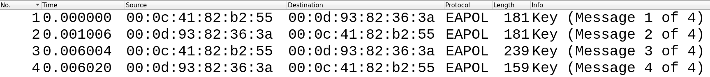

<p align="center">
  
</p>

# cr4gg

**Crack** WPA keys via recorded **4**-Way Handshake.  
This version requires that the 4-Way Handshake is in an isolated pcap file, you can use [Wireshark](https://wireshark.org) for example, to acquire a result similar to this:
  

The current implementation was tested on Wireshark's `wpa-Induction.pcap` [sample capture](https://wiki.wireshark.org/SampleCaptures#wifi-wireless-lan-captures-802-11).

Example Run:
```bash
go run cr4gg.go --ssid Coherer -f $HOME/handshake.pcap -w $HOME/wordlist.txt -v
```

## Disclaimer
This project's solely purpose is to gain more knowledge about wifi security and the language [go](https://golang.org).
Do not use this tool to attack networks you do not have the permission to pentest on.
